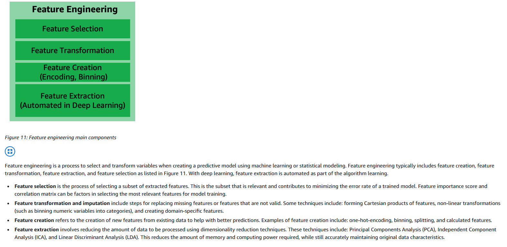

# Features engineering

## Bibliothèques existantes 

| Capacité clé / Lib                                                   | feature-engine                                                 | Featuretools                                                                 | autofeat                                     | tsfresh                                                                                       | category_encoders                                                   | dirty_cat / skrub                                                 |
| -------------------------------------------------------------------- | -------------------------------------------------------------- | ---------------------------------------------------------------------------- | -------------------------------------------- | --------------------------------------------------------------------------------------------- | ------------------------------------------------------------------- | ----------------------------------------------------------------- |
| Imputation valeurs manquantes                                        | ✅ (imputers dédiés) ([PyPI][1])                                | ❌ (à faire avant)                                                            | ❌                                            | 🟡 (un peu, mais pas le cœur) ([tsfresh.readthedocs.io][2])                                   | 🟡 (considère NA comme catégorie) ([PyPI][3])                       | 🟡 (NA traités comme valeurs) ([PyPI][4])                         |
| Encodage catégorielles “classique”                                   | ✅ (one-hot, ordinal, rare-label…) ([PyPI][1])                  | ❌                                                                            | ❌                                            | ❌                                                                                             | ✅ (grand catalogue d’encodeurs) ([PyPI][3])                         | ✅ (TableVectorizer, encoders) ([PyPI][4])                         |
| Haute cardinalité / catégories “sales”                               | 🟡 (gestion des modalités rares) ([PyPI][1])                   | ❌                                                                            | ❌                                            | ❌                                                                                             | ✅ (hashing, target, leave-one-out…) ([contrib.scikit-learn.org][5]) | ✅ (similarity / MinHash / GapEncoder pour dirty cats) ([PyPI][4]) |
| Transfo numériques (log, scaling, binning…)                          | ✅ (transformers + scaling + discrétisation) ([PyPI][1])        | 🟡 (via primitives simples) ([featuretools.alteryx.com][6])                  | ✅ (powers, interactions, etc.) ([GitHub][7]) | 🟡 (beaucoup de stats dérivées mais pas du “preproc” classique) ([tsfresh.readthedocs.io][2]) | ❌                                                                   | ❌                                                                 |
| Gestion des outliers                                                 | ✅ (winsorisation, capping…) ([PyPI][1])                        | ❌                                                                            | ❌                                            | ❌                                                                                             | ❌                                                                   | ❌                                                                 |
| Features datetime / temporelles simples                              | ✅ (extracteurs de dates, lags basiques) ([PyPI][1])            | ✅ (primitives temporelles) ([featuretools.alteryx.com][6])                   | ❌                                            | ✅ (index temporel natif) ([tsfresh.readthedocs.io][2])                                        | ❌                                                                   | 🟡 (via TableVectorizer / détection de types) ([PyPI][4])         |
| Agrégations multi-tables (relational)                                | ❌                                                              | ✅ (Deep Feature Synthesis multi-tables) ([featuretools.alteryx.com][6])      | ❌                                            | ❌                                                                                             | ❌                                                                   | ❌                                                                 |
| Génération auto de nouvelles features (combinaisons, non-linéarités) | ✅ (variable creation) ([PyPI][1])                              | ✅ (DFS crée des features complexes) ([featuretools.alteryx.com][6])          | ✅ (cœur de la lib) ([GitHub][7])             | ✅ (100+ features TS automatiques) ([tsfresh.readthedocs.io][2])                               | 🟡 (nouvelles colonnes = encodages)                                 | 🟡 (nouvelles colonnes à partir de texte/cats) ([PyPI][4])        |
| Sélection de features intégrée                                       | ✅ (sélecteurs dédiés) ([PyPI][1])                              | ❌                                                                            | ✅ (multi-step selection) ([arXiv][8])        | ✅ (tests de pertinence / importance) ([tsfresh.readthedocs.io][2])                            | ❌                                                                   | ❌                                                                 |
| Features séries temporelles avancées                                 | 🟡 (un peu, mais limité) ([feature-engine.trainindata.com][9]) | ✅ (sur données temporelles multi-tables) ([featuretools.alteryx.com][6])     | ❌                                            | ✅ (cœur de la lib) ([tsfresh.readthedocs.io][2])                                              | ❌                                                                   | ❌                                                                 |
| Support texte / verbatims (features dédiées)                         | ❌                                                              | 🟡 (traité comme catégorie, pas sémantique)                                  | ❌                                            | ❌                                                                                             | 🟡 (texte court vu comme catégorie)                                 | ✅ (spécialisé texte/cats “sales”) ([PyPI][4])                     |
| Intégration sklearn (fit/transform)                                  | ✅ (transformers sklearn-like) ([PyPI][1])                      | 🟡 (produit un DataFrame, à brancher soi-même) ([docs.featuretools.com][10]) | ✅ (estimator compatible) ([GitHub][7])       | 🟡 (API propre mais pas 100% sklearn) ([tsfresh.readthedocs.io][2])                           | ✅                                                                   | ✅ ([PyPI][3])                                                     |

[1]: https://pypi.org/project/feature-engine/?utm_source=chatgpt.com "feature-engine"
[2]: https://tsfresh.readthedocs.io/?utm_source=chatgpt.com "tsfresh — tsfresh 0.20.3.post0.dev10+ga15b8fa documentation"
[3]: https://pypi.org/project/category-encoders/?utm_source=chatgpt.com "category-encoders"
[4]: https://pypi.org/project/dirty-cat/?utm_source=chatgpt.com "dirty-cat - PyPI"
[5]: https://contrib.scikit-learn.org/category_encoders/?utm_source=chatgpt.com "Category Encoders 2.8.1 documentation"
[6]: https://featuretools.alteryx.com/en/stable/getting_started/afe.html?utm_source=chatgpt.com "Deep Feature Synthesis — Featuretools 1.31.0 documentation"
[7]: https://github.com/cod3licious/autofeat?utm_source=chatgpt.com "cod3licious/autofeat: Linear Prediction Model with ..."
[8]: https://arxiv.org/abs/1901.07329?utm_source=chatgpt.com "The autofeat Python Library for Automated Feature Engineering and Selection"
[9]: https://feature-engine.trainindata.com/en/1.6.x/?utm_source=chatgpt.com "Feature-engine — 1.6.2"
[10]: https://docs.featuretools.com/en/latest/?utm_source=chatgpt.com "What is Featuretools? — Featuretools 1.31.0 documentation"

# Articles

https://www.tredence.com/blog/automated-feature-engineering#:~:text=According%20to%20a%20recent%20study%2C,even%20manual%20methods%20often%20miss

### Encoding

| encoding          | Idée principale                                                          | Avantages                                               | Inconvénients                                            | Quand l’utiliser                                        |
| ----------------- | ------------------------------------------------------------------------ | ------------------------------------------------------- | -------------------------------------------------------- | ------------------------------------------------------- |
| `one_hot`         | 1 colonne binaire par modalité                                           | Simple, interprétable, pas de fuite                     | Dimension explose si haute cardinalité                   | Catégorielles faible cardinalité                        |
| `target_encoding` | Remplace chaque modalité par une stat de la cible (souvent moyenne de y) | Compact, puissant pour haute cardinalité                | Risque de fuite si mal fait, besoin de KFold / smoothing | Catégorielles moy./haute cardinalité, classification    |
| `ordinal`         | Map catégorie → entier (0, 1, 2, …)                                      | Compact, OK si ordre réel                               | Introduit un faux ordre si pas ordinal                   | Variables réellement ordonnées                          |
| `hashing`         | Hash(category) → index dans espace fixe de dimension k                   | Dimension contrôlée, scalable, pas de mapping à stocker | Collisions, peu interprétable                            | Très haute cardinalité, production / streaming          |
| `None`            | Pas d’encodage spécifique à ce stade                                     | Flexible, évite de doubler les traitements              | Si tu oublies de traiter la colonne ensuite, souci       | Numériques, texte à encoder ailleurs, features droppées |

### Différentes optimisations des features 

Oui, les techniques d'optimisation et d'évaluation rapide utilisées dans les systèmes AutoML s'appliquent effectivement au test de l'ingénierie des features (feature engineering), car cette étape est souvent intégrée au pipeline AutoML pour explorer efficacement des transformations et sélections de variables.

- **Les méthodes d'optimisation intelligentes accélèrent les tests** : AutoML emploie des approches comme l'optimisation bayésienne, les algorithmes évolutionnaires et l'apprentissage par renforcement pour évaluer rapidement des combinaisons de features sans tester exhaustivement toutes les possibilités, en se concentrant sur les plus prometteuses.
- **Lien avec les ensembles de validation** : Des ensembles de validation plus petits ou des techniques comme la validation croisée permettent des évaluations rapides des features, bien que des tailles réduites puissent introduire du bruit ; un équilibre est nécessaire pour maintenir la fiabilité sans sacrifier la vitesse.
- **Efficacité prouvée dans la pratique** : Des outils comme Azure AutoML ou PyCaret démontrent que ces méthodes réduisent le temps de test pour l'ingénierie des features, avec des gains en performance et en ressources computationnelles, tout en évitant la sur-adaptation.

**Méthodes d'optimisation pour l'ingénierie des features**  
Dans AutoML, l'ingénierie des features (souvent appelée AutoFE) est traitée comme un problème d'optimisation bi-niveau, où les transformations (comme les logarithmes, ratios ou encodages) sont générées et évaluées efficacement. Par exemple, l'apprentissage par renforcement guide un agent pour sélectionner des opérations sur les features, en maximisant les scores sur des ensembles de validation. Les algorithmes évolutionnaires évoluent des structures arborescentes de features via mutations et croisements, évaluant la "fitness" via des métriques rapides. Ces techniques évitent les recherches exhaustives, réduisant les tests à des centaines au lieu de millions.

**Rôle des ensembles de validation**  
Les ensembles de validation sont essentiels pour estimer l'erreur de généralisation lors du test des features. AutoML utilise souvent une validation croisée (par exemple, 5-fold) pour évaluer les combinaisons sans biais, permettant des itérations rapides. Des méthodes multi-fidélité commencent avec de petits sous-ensembles pour des tests préliminaires, réservant des validations complètes aux candidats finaux. Cela accélère le processus, mais nécessite un calibrage pour éviter le bruit dans les métriques.

**Exemples d'outils et implémentations**  
Dans Azure AutoML, la "featurization" automatisée intègre des normalisations et imputations dans des pipelines parallèles, testés itérativement avec des ensembles de validation séparés pour une évaluation impartiale. ArcGIS Pro génère des "golden features" et utilise une recherche aléatoire pour les hyperparamètres, en évaluant via des ensembles de validation pour une optimisation rapide. Des outils comme PyCaret se distinguent par leur efficacité, avec des temps d'exécution courts pour tester des configurations de features.

---

L'ingénierie des features (feature engineering) représente une composante critique des pipelines d'apprentissage automatique, où des transformations et sélections de variables sont appliquées pour améliorer la performance des modèles. Dans le contexte des systèmes AutoML (Automated Machine Learning), qui visent à automatiser l'ensemble du workflow ML – de la préparation des données à la sélection de modèles – l'ingénierie des features est souvent intégrée sous forme d'AutoFE (Automated Feature Engineering). Cette automatisation permet de tester rapidement un large éventail de combinaisons de features, en s'appuyant sur des techniques d'optimisation avancées qui évitent les explorations exhaustives. Ces méthodes s'appliquent directement au test pur de l'ingénierie des features, car elles traitent la génération et l'évaluation de features comme un problème d'optimisation combinatorielle, souvent NP-complet, nécessitant des heuristiques intelligentes pour une efficacité computationnelle.

Les approches principales incluent l'apprentissage par renforcement (RL), où un agent explore un graphe de transformations (par exemple, unary comme log1p ou binary comme ratios) pour maximiser une récompense basée sur la performance de validation. Par exemple, des frameworks comme FeatureRL utilisent des graphes où les nœuds représentent des opérations, et l'agent navigue de la racine aux feuilles pour générer des features dérivées, évaluant l'efficacité via des scores de validation croisée. Les algorithmes évolutionnaires (EA), tels que la programmation génétique, représentent les features sous forme d'arbres : les feuilles sont des features originales ou constantes, et les nœuds internes des opérateurs arithmétiques. Des opérations de mutation et croisement évoluent ces structures, avec une "fitness" calculée sur des ensembles de validation pour sélectionner les meilleurs candidats. Ces techniques réduisent le nombre d'évaluations nécessaires en se concentrant sur des sous-espaces prometteurs, souvent via des modèles surrogates qui prédisent les performances sans entraînement complet.

D'autres méthodes, comme la synthèse de features profondes (Deep Feature Synthesis) pour des datasets relationnels, appliquent des agrégations automatisées, tandis que des approches basées sur le meta-learning entraînent des classificateurs sur des meta-features (telles que la moyenne, variance ou corrélation) pour prédire les transformations optimales sans tester toutes les combinaisons. Dans GELFE, une méthode meta-learning limite le nombre de features construites (7-20 unaires/binaires) et impose des contraintes temporelles (15 minutes pour les évaluations binaires), rendant les tests rapides tout en maintenant des gains d'accuracy moyens de 0.54% lorsqu'intégrée à AutoML comme TPOT.

Les ensembles de validation jouent un rôle pivotal dans cette efficacité, servant à estimer l'erreur de généralisation et à guider l'optimisation. Dans la formulation bi-niveau d'AutoFE, la boucle interne entraîne des modèles sur l'ensemble d'entraînement, tandis que la boucle externe évalue les features sur l'ensemble de validation pour minimiser la perte, évitant ainsi la sur-adaptation. La validation croisée (souvent 5-fold) est couramment utilisée pour robustifier les métriques, permettant des évaluations rapides sur des plis plus petits sans compromettre la fiabilité globale. Par exemple, dans Azure AutoML, les données sont divisées en ensembles d'entraînement et de validation pour tuner les hyperparamètres des features, avec une option pour un ensemble de test séparé afin d'éviter les biais d'évaluation répétés. Des méthodes multi-fidélité, comme dans Hyperband, commencent par des évaluations "bon marché" sur de petits sous-ensembles de validation, allouant plus de ressources aux features prometteuses, ce qui accélère les tests initiaux tout en atténuant le bruit potentiel des petites tailles d'ensembles.

Dans ArcGIS Pro, l'AutoML génère des "golden features" via des combinaisons automatisées et des grilles spatiales, en commençant par des modèles simples (comme des arbres de décision de profondeur limitée) pour des tests rapides, avant une recherche aléatoire des hyperparamètres. Les ensembles de validation évaluent ces features pour sélectionner les plus prédictives, en utilisant des métriques comme RMSE ou AUC pour itérer vers des ensembles de modèles. Une étude comparative de outils comme PyCaret, AutoGluon et TPOT sur sept datasets montre que PyCaret excelle en efficacité, avec des temps d'exécution courts (par exemple, 37 secondes sur un dataset marketing) et une faible consommation mémoire, tout en intégrant l'AutoFE via des méthodes comme Lasso pour la sélection. Cependant, des outils comme TPOT peinent avec les contraintes temporelles, complétant seulement 42.86% des optimisations, soulignant l'importance d'une gestion astucieuse des ressources.

Ces approches assurent un équilibre entre exploration et exploitation, avec des gains computationnels significatifs : par exemple, des réductions de temps de 10-100x par rapport aux méthodes manuelles. Néanmoins, des défis persistent, comme la sensibilité au bruit dans les petits ensembles de validation, qui peut mener à des instabilités dans les métriques, ou le risque de sur-adaptation si la validation est trop sollicitée – un point soulevé dans des discussions sur l'usage excessif des ensembles de validation comme "ensemble d'entraînement effectif". Pour contrer cela, des pratiques comme la séparation stricte des ensembles (entraînement, validation, test) avant l'AutoFE sont recommandées, évitant les fuites de données.

| Technique d'optimisation | Description | Efficacité pour le test de features | Rôle des ensembles de validation | Exemples d'outils |
|--------------------------|-------------|-----------------------------|----------------------------------|-------------------|
| Apprentissage par renforcement (RL) | Agent explore un graphe de transformations pour maximiser une récompense basée sur la performance. | Réduit les tests en se focalisant sur des chemins prometteurs ; évaluations itératives rapides. | Fournit la récompense via scores de perte ; utilise CV pour robustesse. | FeatureRL, NFS |
| Algorithmes évolutionnaires (EA) | Évolution d'arbres de features via mutation/croisement ; fitness évaluée sur sous-ensembles. | Évite l'exhaustivité via populations évolutives ; parallélisable pour vitesse. | Calcule la fitness avec CV ; minimise l'erreur de généralisation. | Programmation génétique dans TPOT |
| Meta-learning | Prédit les transformations optimales via meta-features et modèles pré-entraînés. | Limite les tests réels en prédisant l'efficacité ; contraintes temporelles intégrées. | Détermine les meta-cibles via CV sur classificateurs multiples. | GELFE intégré à AutoML |
| Multi-fidélité (e.g., Hyperband) | Évaluations progressives avec ressources croissantes ; élimination précoce des faibles. | Accélère en commençant par petits sous-ensembles ; alloue ressources aux meilleurs. | Utilise petits validation pour tests initiaux, complets pour finaux. | Azure AutoML, ArcGIS Pro |
| Recherche aléatoire/itérative | Sweep initial large, puis raffinement ; pipelines parallèles. | Rapide pour espaces vastes ; intègre features dans itérations. | Tune hyperparamètres et évalue features sans biais. | AutoGluon, PyCaret, H2O-AutoML |

En résumé, les techniques AutoML pour l'ingénierie des features non seulement s'appliquent mais sont optimisées pour une efficacité maximale, en reliant étroitement les optimisations aux évaluations via ensembles de validation. Cela démocratise l'accès à des modèles performants, même pour des datasets complexes, tout en soulignant la nécessité d'un calibrage prudent pour équilibrer vitesse et précision.

**Key Citations:**
- [Techniques for Automated Machine Learning](https://kdd.org/exploration_files/7._CR._27._Techniques_for_Automated_Machine_Learning-2.pdf)
- [Automated Feature Engineering for Automated Machine Learning](https://personal.eur.nl/frasincar/papers/KBS2025a/kbs2025a.pdf)
- [What is automated ML? AutoML - Azure Machine Learning](https://learn.microsoft.com/en-us/azure/machine-learning/concept-automated-ml)
- [A Survey of Evaluating AutoML and Automated Feature Engineering Tools](https://www.scitepress.org/Papers/2025/132667/132667.pdf)
- [How AutoML works—ArcGIS Pro | Documentation](https://pro.arcgis.com/en/pro-app/3.3/tool-reference/geoai/how-automl-works.htm)
- [Automated Feature Engineering: Shaping the Future of AI & ML](https://www.tredence.com/blog/automated-feature-engineering)
- [[D] Why don't you use automated feature engineering - Reddit](https://www.reddit.com/r/MachineLearning/comments/wcm3gn/d_why_dont_you_use_automated_feature_engineering/)